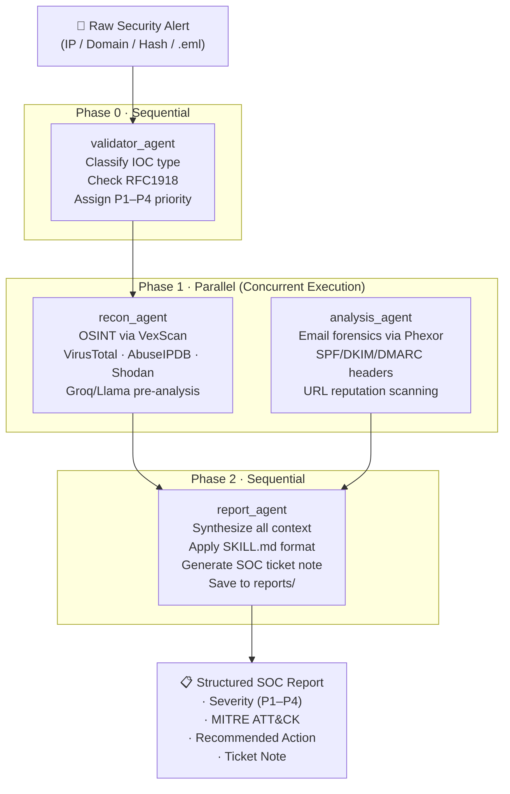

<div align="center">

<h1>🛡️ SentinelLoop</h1>
<p><strong>Multi-Agent SOC Triage Pipeline</strong></p>
<p><em>Automate Tier-1 alert triage from hours to seconds using Google ADK + FastMCP</em></p>

[](https://python.org)
[](https://google.github.io/adk-docs/)
[](https://github.com/jlowin/fastmcp)
[](https://groq.com)
[](https://docker.com)
[](LICENSE)
[](https://kaggle.com)

<br/>

> **AI Agents Intensive — Capstone Project** · Built by [Mohammed Roshan T](https://github.com/MohammedRoshanT) with [Antigravity](https://deepmind.google) · July 2026

<br/>

[Demo Video](https://youtu.be/trahog1niLU) · [Kaggle Writeup](https://www.kaggle.com/competitions/vibecoding-agents-capstone-project/writeups/new-writeup-1783229986993) · [Architecture](#architecture) · [Setup](#setup) · [Docker](#docker-deployment)

</div>

---

## 📋 Table of Contents

- [Overview](#overview)
- [Architecture](#architecture)
  - [Pipeline Flow](#pipeline-flow)
  - [Agent Definitions](#agent-definitions)
  - [Dual-AI Layer Design](#dual-ai-layer-design)
- [Components](#components)
  - [soc\_triage\_agent — Orchestration Layer](#soc_triage_agent--orchestration-layer)
  - [VexScan — OSINT Threat Intelligence](#vexscan--osint-threat-intelligence)
  - [Phexor — Phishing Forensics](#phexor--phishing-forensics)
- [MCP Server Tools](#mcp-server-tools)
- [Agent Skills & Rules](#agent-skills--rules)
- [Setup](#setup)
- [Docker Deployment](#docker-deployment)
- [Cloud Run Deployment](#cloud-run-deployment)
- [API Reference](#api-reference)
- [Security Engineering](#security-engineering)
- [API Keys](#api-keys)
- [Project Structure](#project-structure)
- [Built With Antigravity](#built-with-antigravity)

---

## Overview

Enterprise SOCs drown in alert fatigue. Tier-1 analysts spend hours manually cross-referencing SIEM logs against threat intelligence feeds — a repetitive, error-prone process that burns time and budget.

**SentinelLoop** replaces this manual layer with a fully automated, AI-driven triage pipeline. It ingests a raw security indicator (IP address, domain, file hash, or `.eml` artifact), dispatches parallel OSINT and forensic investigations, and synthesizes a clinical, structured SOC report — all in seconds.

### What SentinelLoop does in one pipeline run:

| Step | What Happens |
|------|-------------|
| **Validate** | Classifies the indicator type (IP/domain/hash/email), checks for RFC1918/known-safe IPs, assigns an initial P1–P4 priority |
| **Recon (parallel)** | Queries VirusTotal, AbuseIPDB, and Shodan in parallel; a Groq/Llama layer pre-synthesizes findings |
| **Forensics (parallel)** | Parses `.eml` artifacts; extracts SPF/DKIM/DMARC auth headers; scans embedded URLs via VirusTotal + URLscan.io |
| **Report** | Compiles a fully structured SOC ticket note with severity rating, MITRE ATT&CK mapping, and recommended action |

---

## Architecture

SentinelLoop uses a **hybrid Parallel-then-Sequential** multi-agent pattern built on Google ADK primitives. The design prioritizes speed (parallel triage) without sacrificing synthesis quality (sequential reporting).

```
┌─────────────────────────────────────────────────────────────────┐
│                     SequentialAgent (root_agent)                │
│                                                                  │
│  ┌──────────────────────┐                                        │
│  │  Phase 0             │                                        │
│  │  validator_agent     │  ← Classify IOC · Check RFC1918 ·     │
│  │  (LlmAgent)          │    Assign initial priority (P1–P4)     │
│  └──────────┬───────────┘                                        │
│             │                                                     │
│  ┌──────────▼──────────────────────────────────────────────┐    │
│  │  Phase 1  ─  ParallelAgent (parallel_triage_agent)      │    │
│  │                                                          │    │
│  │  ┌─────────────────────┐  ┌─────────────────────────┐  │    │
│  │  │  recon_agent        │  │  analysis_agent          │  │    │
│  │  │  (LlmAgent)         │  │  (LlmAgent)              │  │    │
│  │  │                     │  │                          │  │    │
│  │  │  VexScan MCP Tool   │  │  Phexor MCP Tool         │  │    │
│  │  │  · VirusTotal       │  │  · EML Parsing           │  │    │
│  │  │  · AbuseIPDB        │  │  · SPF/DKIM/DMARC        │  │    │
│  │  │  · Shodan           │  │  · URL Reputation        │  │    │
│  │  │  · Groq/Llama AI    │  │  · Groq/Llama AI         │  │    │
│  │  └─────────────────────┘  └─────────────────────────┘  │    │
│  └──────────┬───────────────────────────────────────────────┘   │
│             │                                                     │
│  ┌──────────▼───────────┐                                        │
│  │  Phase 2             │                                        │
│  │  report_agent        │  ← Synthesize · Apply SKILL.md format │
│  │  (LlmAgent)          │    Save report · Output ticket note   │
│  └──────────────────────┘                                        │
└─────────────────────────────────────────────────────────────────┘
```

### Pipeline Flow



### Agent Definitions

All agents are defined in [`soc_triage_agent/multi_tool_agent/agent.py`](soc_triage_agent/multi_tool_agent/agent.py).

| Agent | ADK Type | Output Key | Role |
|-------|----------|-----------|------|
| `validator_agent` | `LlmAgent` | `validation_results` | IOC classification, RFC1918 check, initial priority |
| `recon_agent` | `LlmAgent` | `recon_results` | OSINT via `osint_lookup` / `batch_ioc_scan` MCP tools |
| `analysis_agent` | `LlmAgent` | `analysis_results` | Email forensics via `phishing_forensics` MCP tool |
| `parallel_triage_agent` | `ParallelAgent` | — | Wraps recon + analysis for concurrent execution |
| `report_agent` | `LlmAgent` | `soc_report` | Final synthesis, SKILL.md compliance, disk save |

> **Dynamic Agent Factory**: `create_agent()` re-instantiates the full pipeline on every Streamlit submission. This is architecturally required because ADK's `McpToolset` binds to the active asyncio event loop at creation time — it cannot be shared across sessions.

### Dual-AI Layer Design

SentinelLoop employs a **double-LLM pattern** for maximum signal quality:

```
External APIs → Groq Llama 3.3 70B (VexScan/Phexor) → Gemini (report_agent)
               └── Pre-synthesizes raw API data     └── Synthesizes structured findings
```

By the time raw VirusTotal/AbuseIPDB/Shodan data reaches the Gemini orchestrator, it has already been interpreted and summarized by Groq's Llama model within each microservice. This dramatically reduces noise in the final report.

---

## Components

### `soc_triage_agent` — Orchestration Layer

The central orchestration service. Hosts the Streamlit UI and runs the full ADK multi-agent pipeline.

**Port:** `8501` (Streamlit) | `8000` (ADK Web UI — dev mode)

| File | Purpose |
|------|---------|
| `multi_tool_agent/agent.py` | All 5 agent definitions + `create_agent()` factory |
| `mcp_server.py` | FastMCP server exposing 4 tools to ADK agents |
| `app.py` | Streamlit chat UI with API key management, model selector, chat history |
| `multi_tool_agent/__init__.py` | Exports `root_agent` for `adk web` discovery |

**Gemini model options** available in the UI: `gemini-2.5-flash`, `gemini-2.0-flash`, `gemini-1.5-flash`, `gemini-1.5-pro-preview`, `gemini-1.5-flash-lite`

**Retry logic:** 6 attempts, exponential backoff (2s → 60s max), handles `408, 429, 500, 502, 503, 504` — built for free-tier rate limits.

---

### VexScan — OSINT Threat Intelligence

**Port:** `8003` | **Framework:** FastAPI | **LLM:** Groq Llama 3.3 70B Versatile

Automated threat intelligence aggregator routing to three live external APIs.

#### API Endpoints

| Method | Endpoint | Description |
|--------|---------|-------------|
| `GET` | `/health` | `{"status": "ok"}` |
| `GET` | `/dashboard` | Web dashboard UI |
| `POST` | `/scan/ip` | IP reputation (VirusTotal + AbuseIPDB + Shodan) |
| `POST` | `/scan/domain` | Domain reputation (VirusTotal) |
| `POST` | `/scan/hash` | File hash lookup (VirusTotal, MD5/SHA1/SHA256) |
| `POST` | `/scan/auto` | Auto-detects indicator type and routes correctly |
| `POST` | `/scan/batch` | Batch scan up to 10 IOCs |

**Request format:** `{"target": "1.2.3.4"}` · **Batch:** `{"targets": ["1.2.3.4", "evil.com"]}`

#### VexScan Modules

| Module | External API | Key Data Returned |
|--------|-------------|------------------|
| `virustotal.py` | VirusTotal v3 | `malicious`, `suspicious`, `harmless`, `undetected`, `reputation`, `country`, `name` |
| `abuseipdb.py` | AbuseIPDB v2 | `abuse_confidence_score`, `total_reports`, `isp`, `is_tor`, `last_reported` |
| `shodan_lookup.py` | Shodan SDK | `open_ports`, `organization`, `os`, `city`, `vulns` (CVE IDs), `tags` |
| `ai_analyst.py` | Groq (Llama) | Pre-synthesized verdict, risk score (0–100), key findings, MITRE ATT&CK |

> **Note:** `scan_domain` and `scan_hash` query VirusTotal only (AbuseIPDB/Shodan are IP-only services). This is architecturally correct behavior.

---

### Phexor — Phishing Forensics

**Port:** `8001` | **Framework:** FastAPI | **LLM:** Groq Llama 3.3 70B Versatile

Phishing email analysis engine. Accepts raw `.eml` file uploads and performs multi-layer forensic analysis.

#### API Endpoints

| Method | Endpoint | Description |
|--------|---------|-------------|
| `GET` | `/` | Web dashboard UI |
| `POST` | `/analyze` | Upload `.eml` file; returns full forensic report |

**Enforces:** `.eml` extension validation · Temp file cleanup (always in `finally` block) · MCP layer enforces 500KB payload limit

#### Phexor Modules

| Module | Mechanism | Output |
|--------|-----------|--------|
| `email_parser.py` | Python stdlib `BytesParser` (RFC-compliant) | `sender`, `reply_to`, `spf`, `dkim`, `dmarc`, `sender_ip`, `urls`, `attachments`, `body_preview` |
| `header_analyzer.py` | Pure rule-based detection (no external calls) | `anomalies`, `risk_indicators`, `reply_to_mismatch` |
| `url_scanner.py` | VirusTotal + URLscan.io (limited to **first 5 URLs**) | `final_url`, `ip`, `country`, `score`, `result_link` |
| `ai_analyst.py` | Groq (Llama, temp=0.2) | Phishing verdict, confidence %, attack type, recommended action, MITRE ATT&CK |

**Suspicious keyword detection:** `urgent, verify, suspended, account, click, confirm, update, password, login, bank, winner, prize, free, limited, immediately`

**Sender IP extraction:** Automatically skips RFC1918 private IP ranges (`127.x`, `10.x`, `192.168.x`, `172.x`) when parsing `Received:` headers.

> **Included test artifact:** [`phexor/test_phish.eml`](phexor/test_phish.eml) — a realistic PayPal impersonation email with typo-squatted sender domain, `.ru` reply-to harvester, SPF/DKIM/DMARC failures, and Tor exit node sender IP.

---

## MCP Server Tools

The [`mcp_server.py`](soc_triage_agent/mcp_server.py) runs as a **stdio subprocess** spawned by ADK per session (no separate HTTP server needed). It exposes 4 tools to the agents:

| Tool | Signature | Description |
|------|-----------|-------------|
| `osint_lookup` | `(indicator: str) → str` | Validates indicator format (IPv4/hash/domain regex), POSTs to VexScan `/scan/auto`. 120s timeout. |
| `batch_ioc_scan` | `(iocs: list[str]) → str` | Batch scans up to 10 IOCs via VexScan `/scan/batch`. |
| `phishing_forensics` | `(eml_content: str) → str` | Validates non-empty + ≤500KB, sends to Phexor `/analyze` as `multipart/form-data`. |
| `save_report` | `(report_content: str, indicator: str) → str` | Sanitizes indicator (dots → underscores), saves to `reports/triage_{indicator}.md`. |

**Service URLs** are configurable via environment variables:
- `VEXSCAN_URL` — default `http://localhost:8003`
- `PHEXOR_URL` — default `http://localhost:8001`

---

## Agent Skills & Rules

### Workspace Rule (`.agents/AGENTS.md`)

A critical behavioral constraint injected into every agent:

> **All agents must verify intelligence findings.** If findings are low-confidence or indeterminate (incomplete OSINT, unconfirmed redirects, conflicting reputation votes), the agent **must explicitly flag them for human review** before recommending blocking or quarantining actions.

### SOC Triage Reporting Skill (`.agents/skills/soc-triage-reporting/SKILL.md`)

Governs the `report_agent`'s output format. Loaded from disk at startup and injected directly into the agent instruction.

**Required report sections (in order):**

1. **Alert Summary** — IOC, type, source context
2. **Initial Priority** — From validator agent (P1–P4)
3. **OSINT Findings** — VexScan results summary
4. **Forensic Findings** — Phexor results (or "N/A — not applicable")
5. **Severity** — Final severity with justification
6. **Recommended Action** — Block / Quarantine / Monitor / Escalate / Release
7. **MITRE ATT&CK Mapping** — Technique IDs and names
8. **Ticket Note** — ≤200 words, professional SOC analyst tone

**Severity criteria:**

| Level | Criteria |
|-------|---------|
| **Critical (P1)** | Confirmed malicious with active impact (active C2, known malware executing, clicked phishing links) |
| **High (P2)** | Suspicious with high threat likelihood (SPF+DKIM+DMARC fail + suspicious links; hash flagged by multiple VT engines; AbuseIPDB >50%) |
| **Medium (P3)** | Anomalies present but no confirmed malicious indicators — investigate further |
| **Low (P4)** | Clean reputation across all sources — likely false positive |

---

## Setup

### Prerequisites

- Python 3.11+
- [`uv`](https://docs.astral.sh/uv/) (recommended) or `pip`
- API keys for all 6 services (see [API Keys](#api-keys))

### 1. Clone the Repository

```bash
git clone https://github.com/MohammedRoshanT/SentinelLoop.git
cd SentinelLoop
```

### 2. Configure Environment Variables

Each service reads from its own `.env` file. Create them as follows:

**`soc_triage_agent/.env`**
```env
GEMINI_API_KEY=your_gemini_api_key
VEXSCAN_URL=http://localhost:8003
PHEXOR_URL=http://localhost:8001
```

**`vexscan/.env`**
```env
VT_API_KEY=your_virustotal_api_key
SHODAN_API_KEY=your_shodan_api_key
ABUSEIPDB_API_KEY=your_abuseipdb_api_key
GROQ_API_KEY=your_groq_api_key
```

**`phexor/.env`**
```env
VT_API_KEY=your_virustotal_api_key
URLSCAN_API_KEY=your_urlscan_api_key
GROQ_API_KEY=your_groq_api_key
```

### 3. Install Dependencies

```bash
# VexScan
cd vexscan && uv venv && uv pip install -r requirements.txt && cd ..

# Phexor
cd phexor && uv venv && uv pip install fastapi uvicorn python-multipart requests groq rich python-dotenv && cd ..

# SOC Triage Agent
cd soc_triage_agent && uv venv && uv pip install -r requirements.txt && cd ..
```

### 4. Run All Services

Open **three separate terminals**:

**Terminal 1 — VexScan (Port 8003)**
```bash
cd vexscan
uv run uvicorn api:app --port 8003
```

**Terminal 2 — Phexor (Port 8001)**
```bash
cd phexor
uv run uvicorn api:app --port 8001
```

**Terminal 3 — SentinelLoop UI (Port 8501)**
```bash
cd soc_triage_agent
uv run streamlit run app.py
```

Navigate to **http://localhost:8501** to open the Streamlit chat interface.

> **Dev mode alternative:** Run `uv run adk web` inside `soc_triage_agent/` to use ADK's built-in web UI on port 8000.

---

## Docker Deployment

The entire stack can be launched with a single command using Docker Compose:

```bash
# Create a root .env file with all API keys
cat > .env << EOF
GEMINI_API_KEY=your_key
GROQ_API_KEY=your_key
VT_API_KEY=your_key
SHODAN_API_KEY=your_key
ABUSEIPDB_API_KEY=your_key
URLSCAN_API_KEY=your_key
EOF

docker compose up --build
```

### Service Map

| Service | Image Build Context | Port | Notes |
|---------|-------------------|------|-------|
| `vexscan` | `./vexscan` | `8003` | OSINT threat intelligence |
| `phexor` | `./phexor` | `8001` | Email forensics |
| `soc_agent` | `./soc_triage_agent` | `8000` | ADK orchestration (container uses `adk web`) |

All three services communicate over an internal Docker bridge network (`sentinel_net`). `soc_agent` has `depends_on: [vexscan, phexor]`.

---

## Cloud Run Deployment

SentinelLoop is designed to run as a stateless, serverless containerized microservice on Google Cloud Run.

### Deploy SOC Agent

```bash
cd soc_triage_agent
adk deploy cloud_run \
  --project=YOUR_PROJECT_ID \
  --region=us-central1 \
  --service_name=soc-triage-service \
  --with_ui \
  --set-secrets="GEMINI_API_KEY=GEMINI_API_KEY:latest,\
GROQ_API_KEY=GROQ_API_KEY:latest,\
VT_API_KEY=VT_API_KEY:latest,\
SHODAN_API_KEY=SHODAN_API_KEY:latest,\
ABUSEIPDB_API_KEY=ABUSEIPDB_API_KEY:latest,\
URLSCAN_API_KEY=URLSCAN_API_KEY:latest"
```

### Prerequisites

```bash
# Store API keys in Secret Manager
gcloud secrets create GEMINI_API_KEY --data-file=- <<< "your_key"
gcloud secrets create GROQ_API_KEY --data-file=- <<< "your_key"
# ... repeat for all 6 keys

# Grant Cloud Run access to secrets
gcloud projects add-iam-policy-binding YOUR_PROJECT_ID \
  --member="serviceAccount:YOUR_PROJECT_NUMBER-compute@developer.gserviceaccount.com" \
  --role="roles/secretmanager.secretAccessor"
```

**Cost optimization:** Cloud Run scales to **zero** when no alerts are being processed — you only pay for active inference time.

---

## API Reference

### VexScan `/scan/auto`

```bash
curl -X POST http://localhost:8003/scan/auto \
  -H "Content-Type: application/json" \
  -d '{"target": "45.33.32.156"}'
```

<details>
<summary>Example Response</summary>

```json
{
  "target": "45.33.32.156",
  "type": "ip",
  "virustotal": {
    "malicious": 12,
    "suspicious": 3,
    "harmless": 65,
    "reputation": -50
  },
  "abuseipdb": {
    "abuse_confidence_score": 87,
    "total_reports": 412,
    "isp": "Linode LLC",
    "is_tor": false
  },
  "shodan": {
    "open_ports": [22, 80, 443],
    "organization": "Linode",
    "vulns": ["CVE-2021-44228"]
  },
  "ai_analysis": {
    "verdict": "Malicious",
    "risk_score": 91,
    "key_findings": "...",
    "recommended_action": "Block immediately",
    "mitre_attack": "T1071.001 - Application Layer Protocol"
  }
}
```
</details>

### Phexor `/analyze`

```bash
curl -X POST http://localhost:8001/analyze \
  -F "file=@phexor/test_phish.eml"
```

---

## Security Engineering

SentinelLoop applies defense-in-depth across all layers:

| Layer | Control | Implementation |
|-------|---------|---------------|
| **Input Validation** | Indicator format enforcement | MCP `osint_lookup` validates IPv4/hash/domain with regex before forwarding to VexScan |
| **Payload Size Limit** | DoS / context-window blowout prevention | MCP `phishing_forensics` rejects EML content > 500KB |
| **URL Rate Limiting** | Free-tier API protection | Phexor scans only the **first 5 URLs** per email |
| **Batch Limits** | Prevents API abuse | VexScan batch endpoint capped at **10 IOCs** per request |
| **Rate Limit Retry** | Gemini 429 handling | 6-attempt exponential backoff (2s → 60s) on `429, 500, 502, 503, 504` |
| **Private IP Filtering** | False positive suppression | Sender IP extraction skips RFC1918 ranges automatically |
| **Human Oversight** | Low-confidence escalation | Agents hardcoded to output `Low Confidence` + `Escalate for manual review` when API data is insufficient |
| **Secret Management** | No secrets in code | All keys via `.env` files (excluded from git) or GCP Secret Manager in production |
| **Temp File Cleanup** | No artifact leakage | Phexor always deletes temp EML files in `finally` blocks |

---

## API Keys

| Key | Service | Where to Get |
|-----|---------|-------------|
| `GEMINI_API_KEY` | Google Gemini (orchestrator LLM) | [Google AI Studio](https://aistudio.google.com/apikey) |
| `GROQ_API_KEY` | Groq Llama 3.3 70B (VexScan + Phexor) | [console.groq.com](https://console.groq.com/keys) |
| `VT_API_KEY` | VirusTotal v3 | [virustotal.com](https://www.virustotal.com/gui/my-apikey) |
| `SHODAN_API_KEY` | Shodan | [account.shodan.io](https://account.shodan.io) |
| `ABUSEIPDB_API_KEY` | AbuseIPDB v2 | [abuseipdb.com](https://www.abuseipdb.com/api) |
| `URLSCAN_API_KEY` | URLscan.io | [urlscan.io/user/profile](https://urlscan.io/user/profile/) |

> Free tier keys are sufficient for development and testing. Production workloads with high alert volume should use paid tiers.

---

## Project Structure

```
sentinelloop-capstone/
│
├── soc_triage_agent/                  # ADK orchestration layer
│   ├── multi_tool_agent/
│   │   ├── agent.py                   # All 5 agent definitions + create_agent() factory
│   │   └── __init__.py                # Exports root_agent for adk web
│   ├── mcp_server.py                  # FastMCP server (4 tools)
│   ├── app.py                         # Streamlit chat UI
│   ├── reports/                       # Saved triage reports (git-ignored)
│   ├── Dockerfile
│   └── requirements.txt
│
├── vexscan/                           # OSINT threat intelligence service
│   ├── api.py                         # FastAPI app (port 8003)
│   ├── main.py                        # Standalone CLI entry point
│   ├── modules/
│   │   ├── virustotal.py
│   │   ├── abuseipdb.py
│   │   ├── shodan_lookup.py
│   │   └── ai_analyst.py             # Groq/Llama synthesis
│   ├── dashboard/                     # Web UI assets
│   ├── Dockerfile
│   └── requirements.txt
│
├── phexor/                            # Phishing email forensics service
│   ├── api.py                         # FastAPI app (port 8001)
│   ├── main.py                        # Standalone CLI entry point
│   ├── modules/
│   │   ├── email_parser.py
│   │   ├── header_analyzer.py
│   │   ├── url_scanner.py
│   │   └── ai_analyst.py             # Groq/Llama synthesis
│   ├── test_phish.eml                 # Sample phishing artifact for testing
│   ├── dashboard/                     # Web UI assets
│   ├── Dockerfile
│   └── requirements.txt
│
├── notebook/
│   └── sentinelloop_demo.ipynb        # Jupyter demo notebook
│
├── .agents/
│   ├── AGENTS.md                      # Workspace behavioral rules
│   └── skills/soc-triage-reporting/
│       └── SKILL.md                   # Report format + severity criteria
│
├── SentinelLoop_Dashboard.html        # Static project launchpad UI
├── docker-compose.yml                 # Full-stack orchestration
└── .gitignore
```

---

## Built With Antigravity

This project was developed with **[Antigravity](https://deepmind.google)**, Google DeepMind's advanced agentic coding AI, acting as a pair-programmer throughout the build.

Antigravity contributed to:
- Designing the multi-agent orchestration pipeline architecture
- Implementing the `McpToolset` stdio subprocess integration pattern
- Debugging cross-service async communication between ADK and FastMCP
- Writing the agent skill injection system (`SKILL.md` → `instruction` parameter)
- Authoring this documentation

> *SentinelLoop is itself a demonstration of AI-native development workflows — the tooling used to build the pipeline is the same class of technology the pipeline automates.*

---

## License

This project is released under the [MIT License](LICENSE).

Writeup released under [CC BY 4.0](https://creativecommons.org/licenses/by/4.0/).

---

<div align="center">
<sub>Built for the <strong>Google AI Agents Intensive — Capstone 2026</strong> · Mohammed Roshan T</sub>
</div>
